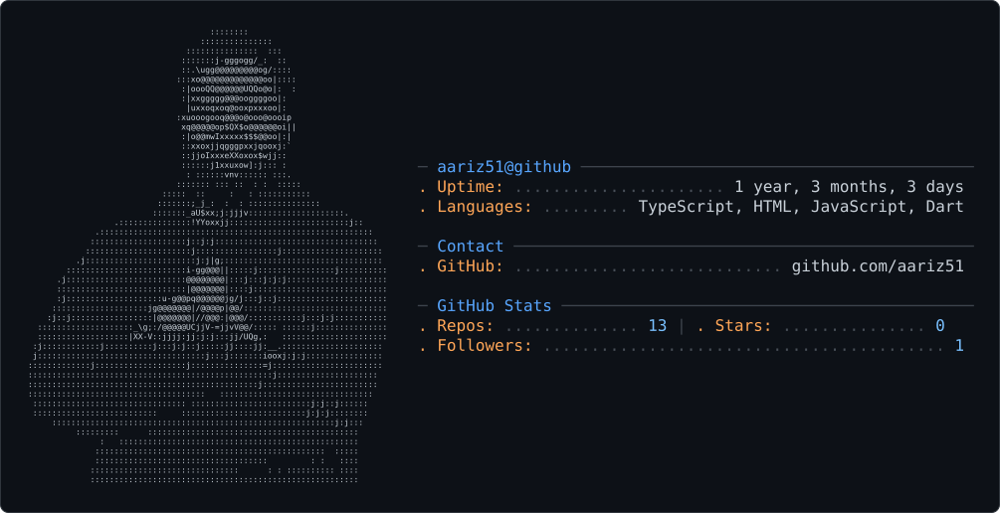

<picture>
  <source media="(prefers-color-scheme: dark)" srcset="dark_mode.svg" />
  <source media="(prefers-color-scheme: light)" srcset="light_mode.svg" />
  
</picture>

# Hi, I'm Aariz

I build AI-powered mobile apps and web products, mostly with Flutter, TypeScript, Next.js, React, Node.js, and AI APIs.

My work is focused on turning practical product ideas into usable apps: product safety scanning, AI video tooling, legal/support pages for shipped apps, and backend systems that connect mobile and web experiences.

Some production apps and App Store/Play Store codebases stay private, but I keep selected open-source and public support projects here so people can see how I think, build, and ship.

## What I work on

- Mobile apps with Flutter and Dart
- AI-assisted consumer products
- SaaS and creator tooling
- Node.js APIs and product backends
- Next.js and React web apps
- App support, privacy, and legal pages

## Featured projects

### Trustit

Open-source Flutter and Node.js app for scanning consumer product labels, reading ingredients, and generating AI-assisted safety analysis.

Repository: [aariz51/Trustit](https://github.com/aariz51/Trustit)

### ProductStory AI

Next.js prototype that turns product demos into structured video scripts and marketing video flows.

Repository: [aariz51/video-ai-](https://github.com/aariz51/video-ai-)

### AI Video Generator

Full-stack React and Node.js video-generation experiment with upload, template selection, processing status, and backend video services.

Repository: [aariz51/ai-video-generator-](https://github.com/aariz51/ai-video-generator-)

### App Legal and Support Pages

Public support/legal pages for shipped app projects, including SiteVoice AI, SafeChoice, and PlantCare.

## Current stack

```text
Mobile:     Flutter, Dart
Frontend:   TypeScript, React, Next.js, Tailwind CSS
Backend:    Node.js, Express
AI:         OpenAI, Gemini, video generation APIs
Storage:    Supabase, Hive, local app storage
Tooling:    GitHub, Vercel-style web workflows, mobile release workflows
```

## How I build

I like building product-first: start with the user flow, make the core feature work, then improve the UI, reliability, onboarding, and release experience. My GitHub is a mix of polished public projects, app support repos, learning repos, and private production work.

## Contact

- GitHub: [@aariz51](https://github.com/aariz51)
